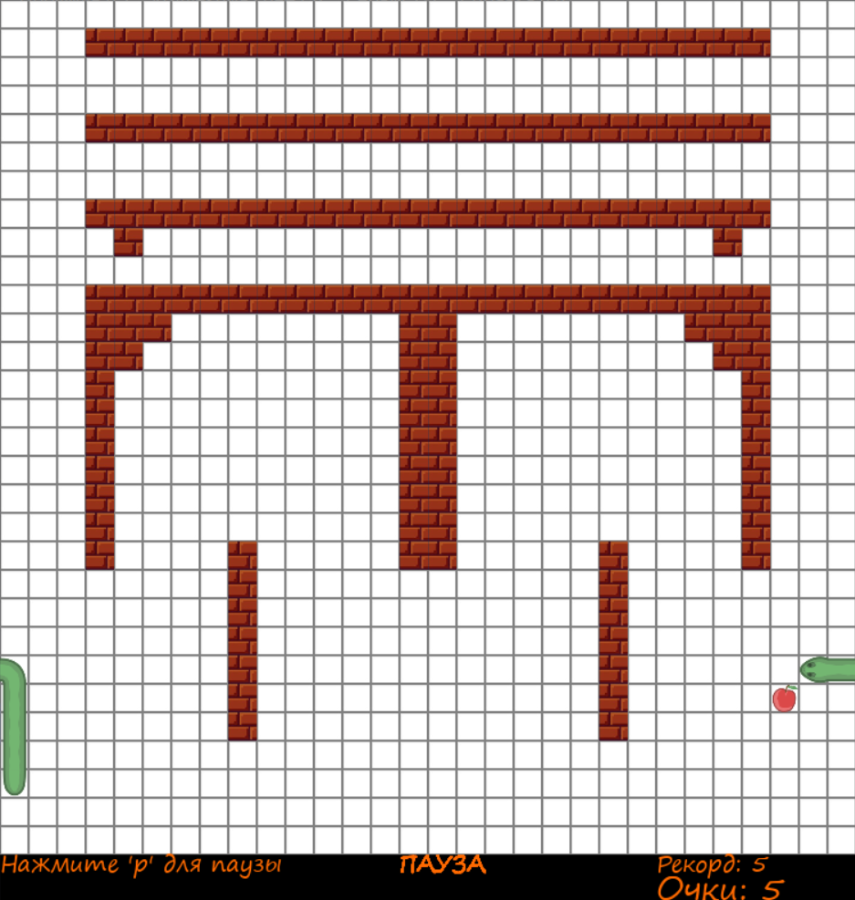
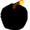

<!-- ABOUT THE PROJECT -->
## 🐍 Змейка с неожиданными поворотами
**Классическая игра "Змейка" с современными механиками и кастомизацией!**<br>
Соберите как можно больше яблок, избегая стен и хвоста, но будьте осторожны — не все яблоки одинаково полезны...


### 🔥 Особенности
• **Разные уровни сложности** — от спокойного до бешеного темпа.<br>
• **Уникальные уровни** — каждый имеет свою схему стен и рекорды.<br>
• **Расширенная кастомизация** — меняйте внешний вид змейки, яблок и фона под свой вкус!<br>
• **Специальные яблоки** — не просто еда, а настоящие сюрпризы (и опасности).

### 🍎 Виды яблок
 - Стандартное яблоко.<br>
 - 	Уничтожает стены вокруг, не причиняя вреда змейке.<br>
 - Меняет голову и хвост местами.<br>
 - Создаёт фальшивки, которые уменьшают змейку. Настоящее яблоко переливается!<br>
 - Позволяет змейке проходить сквозь стены и себя в течение 5 секунд.<br>
 - Превращает часть змейки в стену. В отличие от других яблок приносит игроку 3 очка.<br>

По ходу игры может встречаться каждый вид яблок с определенным шансом.<br>
Для каждого яблока в игре есть индивидуальные визуальные/звуковые эффекты.<br>


### 🛠️ Технологии


<!-- GETTING STARTED -->
## 🚀 Быстрый старт

1. **Клонируйте репозиторий**

   ```sh
   git clone https://github.com/Silent0agent/snake_pygame
   ```
2. **Установите зависимости**

   ```sh
   pip install -r requirements.txt
   ```
3. **Запустите файл с игрой:**

   ```sh
   cd source
   python main.py
   ```

<!-- CONTACT -->
## 📬 Обратная связь

Нашли баг? Есть идея для нового яблока? Хотите похвалить?
Пишите: Silent0agent@yandex.ru

Проект на GitHub: https://github.com/Silent0agent/snake_pygame
